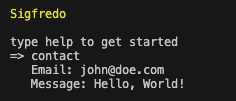

# sshigfredo

Work in progress text-based terminal personal website replacement. A custom SSH server with a contact form built in.

## Where we at

-   [x] SSH server
-   [x] Contact form
-   [ ] Project display

## How to run

-   Rename [`.env.example`](./.env.example) to `.env`
-   Fill in SMTP credentials
-   Run `go run .`
-   Run `ssh 0.0.0.0` in another terminal instance
-   Profit

## License

Licensed under the [MIT License](./LICENSE)
